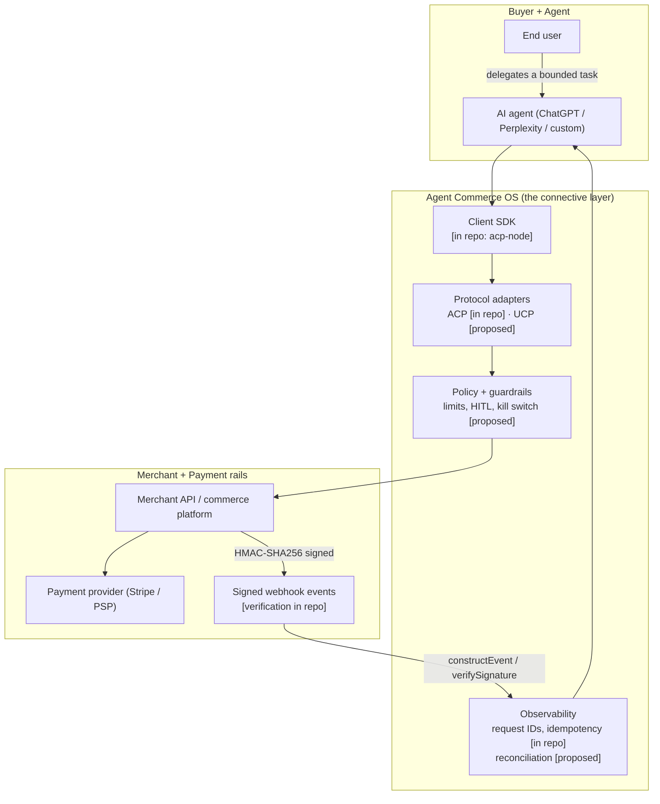
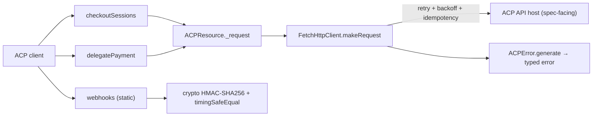
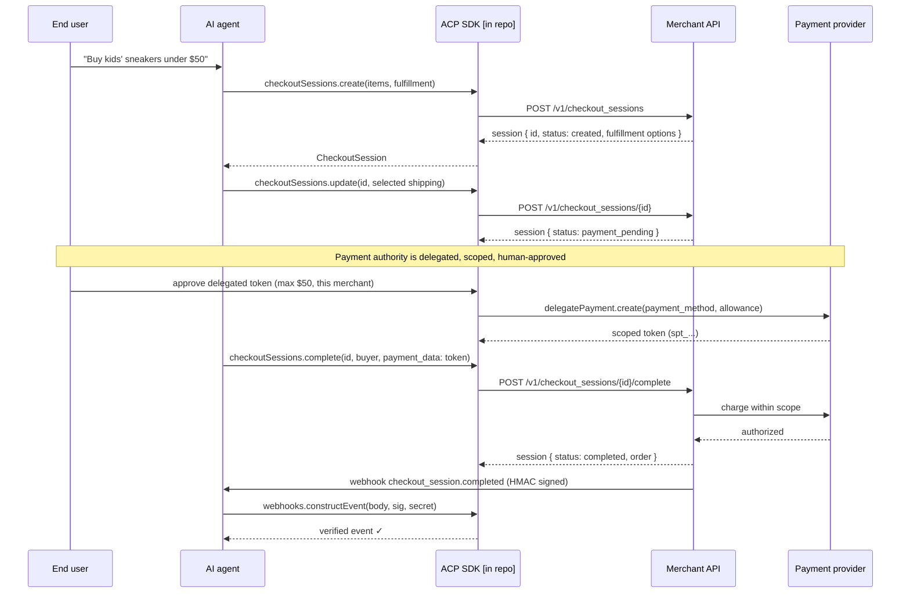
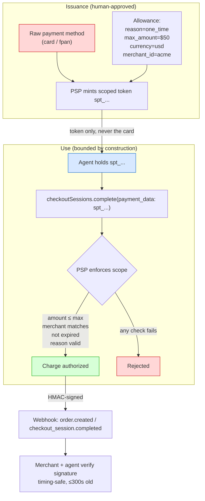

# Architecture - Agent Commerce OS (proposed / reference)

**Read this as a reference architecture and a point of view, not a description of a running system.** Where a component actually exists in this repo, it is marked **[in repo]**. Everything else is **[proposed]**.

The repo contains a **design-stage ACP client SDK** (`demos/acp/acp-node`, ~2,100 lines TypeScript, 35 passing unit tests) plus protocol research (`notes/`, `comparisons/`, `articles/`). The SDK is a Stripe-patterned client: it models the *client-side integration surface* of the Agentic Commerce Protocol. It does not include a backend, and it targets a spec-facing host (`api.agentic-commerce.com`) rather than a live service.

---

## 1. The layers a real Agent Commerce OS would have

**What is real today:** the Client SDK, the ACP adapter surface, request IDs + idempotency in the HTTP client, and webhook signature verification. **What is proposed:** the UCP adapter, the policy/guardrail module, reconciliation, and every backend box (merchant API, PSP) - those are external systems the OS integrates with, not things this repo implements.

## 2. The reference SDK as built [in repo]

A Stripe-SDK-shaped client. Concrete files:

- `src/acp.ts` - `ACP` client: config parsing (api key / version / timeout / retries / host), resource wiring, static `errors` and `webhooks`.
- `src/resources/CheckoutSessions.ts` - `create`, `retrieve`, `update`, `complete`, `cancel`.
- `src/resources/DelegatePayment.ts` - `create` a scoped payment token.
- `src/Webhooks.ts` - `constructEvent`, `verifySignature`, `generateTestHeaderString`; HMAC-SHA256, timestamp tolerance (300s), timing-safe compare.
- `src/net/FetchHttpClient.ts` - fetch-based transport, exponential backoff with jitter, 429 `Retry-After` handling, abort/timeout, idempotency + `X-Request-Id` headers.
- `src/Error.ts` - `ACPError` base + 9 typed subclasses mapped from HTTP status.
- `src/types.ts` - request/response types for sessions, delegation, webhooks.

## 3. Checkout-session flow (sequence)

The lifecycle the SDK is built around: `created -> payment_pending -> completed` (or `cancelled` / `expired`). Human approval is shown at the delegation step because authorizing money is a human decision.

## 4. Delegated-token trust model

The core idea: **the agent never holds a raw credential; it holds a token scoped so tightly that misuse is bounded by construction.** Trust between the three strangers (buyer, merchant, PSP) is established by scope + signatures, not reputation.

**Five invariants the model enforces (from `notes/acp-overview.md` and the SDK):**
1. The agent never sees raw payment credentials.
2. Tokens are scoped to a specific merchant and purpose.
3. Tokens carry a max amount.
4. Tokens expire.
5. Events are HMAC-SHA256 signed and verified with a timestamp tolerance and timing-safe comparison.

**Honest limits of the current implementation:** scope *enforcement* lives on the (non-existent) PSP/backend side; the SDK provides the client surface to request and carry the token, and it provides real, tested verification of the returned signed events. Enforcement, revocation, and settlement are proposed, not built.

## 5. Where the boundaries are

| Concern | This repo | A real deployment |
|---|---|---|
| Client integration surface | **Built** (ACP) | + UCP adapter |
| Webhook verification | **Built + tested** | Same, plus replay/DLQ |
| Retries / idempotency | **Built** | Same |
| Scope enforcement / revocation | Modeled in docs | PSP + backend |
| Backend, settlement, ledger | None | Merchant + PSP |
| Policy / HITL / kill switch | Proposed | Required |
| Reconciliation / audit | Proposed | Zero-tolerance, like money-critical parity |
